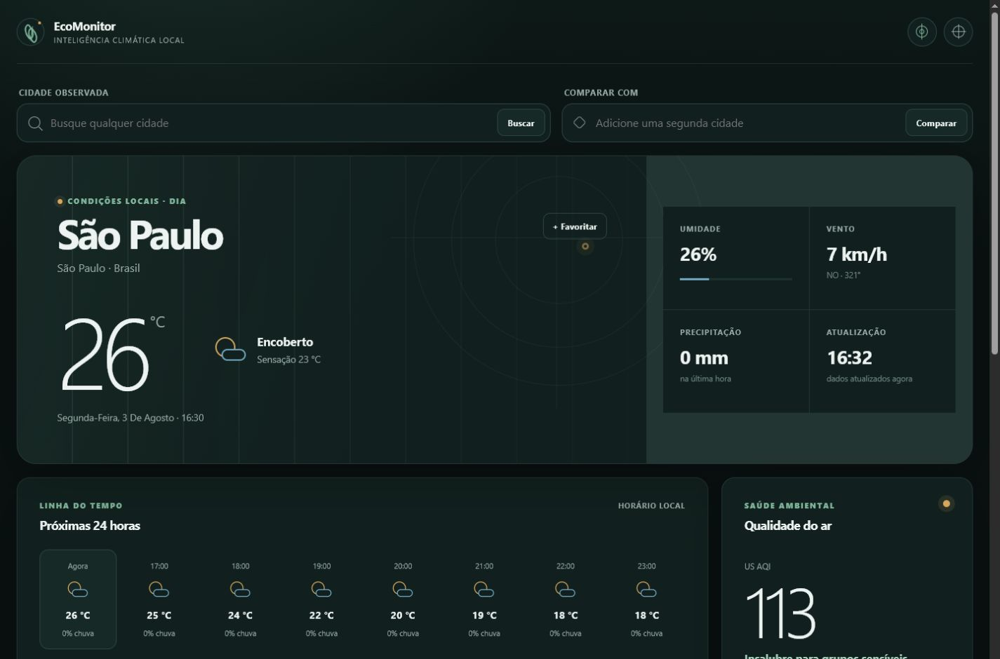

# EcoMonitor 2.0

O EcoMonitor é um dashboard climático global que reúne condições meteorológicas, qualidade do ar, previsão horária e previsão semanal em uma interface única. A aplicação funciona diretamente no navegador, não exige cadastro e utiliza somente APIs públicas e gratuitas.



## Acesso

O projeto será publicado na Vercel. Depois do deploy, ele poderá ser acessado pelo endereço fornecido na página do projeto, normalmente no formato:

```text
https://nome-do-projeto.vercel.app
```

O endereço definitivo deve ser adicionado aqui assim que o primeiro deploy for concluído.

Para executar localmente, siga a seção [Instalação local](#instalação-local).

## Principais recursos

- Busca de cidades em qualquer país.
- Temperatura atual e sensação térmica.
- Umidade, precipitação, velocidade e direção do vento.
- Condição meteorológica traduzida para português.
- Identificação de dia ou noite e horário local da cidade.
- Previsão das próximas 24 horas com gráfico interativo.
- Previsão dos próximos sete dias com mínima, máxima, chuva, nascer e pôr do sol.
- US AQI, PM2.5 e PM10 com classificação e orientação ambiental.
- Comparação entre duas cidades com resumo das diferenças.
- Cidades favoritas e histórico de pesquisas recentes.
- Unidades métricas e imperiais.
- Temas claro, escuro e automático.
- Uso opcional da localização fornecida pelo navegador.
- Último resultado disponível quando não houver conexão.
- Instalação como PWA em navegadores compatíveis.
- Navegação por teclado e suporte a movimento reduzido.

## Como usar

### Consultar uma cidade

1. Digite o nome no campo **Cidade observada**.
2. Use as setas do teclado ou o mouse para escolher um resultado.
3. Pressione `Enter` ou clique na cidade desejada.
4. O painel será atualizado com os dados locais, a previsão e a qualidade do ar.

Os horários são apresentados no fuso da própria cidade, mesmo quando ela estiver em outro país.

### Comparar cidades

1. Selecione a cidade principal.
2. Digite outra localidade no campo **Comparar com**.
3. Escolha um resultado diferente da cidade principal.
4. Consulte as diferenças de temperatura, umidade e AQI.

Os botões da área de comparação permitem inverter as cidades ou remover a comparação.

### Favoritos, unidades e tema

- Use **Favoritar** para guardar a cidade atual no navegador.
- Abra as preferências no canto superior direito para trocar unidades e tema.
- A opção **Remover dados locais** apaga favoritos, recentes, preferências e o último resultado salvo.

### Usar a localização atual

O botão de localização explica quais dados serão utilizados antes de abrir a solicitação de permissão do navegador. As coordenadas são enviadas somente à Open-Meteo para obter os dados climáticos e não são salvas no histórico de cidades.

## Como o projeto funciona

O EcoMonitor é uma aplicação estática construída com Vite e TypeScript. Não existe servidor próprio, banco de dados ou chave de API.

O fluxo de uma consulta é:

1. A API de geocodificação da Open-Meteo transforma o texto pesquisado em uma localidade com coordenadas e timezone.
2. As APIs meteorológica e de qualidade do ar são consultadas em paralelo.
3. As respostas são validadas e transformadas antes de chegarem à interface.
4. Timestamps Unix são formatados com o timezone IANA da cidade.
5. O estado da tela é atualizado e o Chart.js desenha as séries horárias.
6. Preferências, favoritos, recentes e o último resultado ficam no `localStorage` do navegador.

Cada campo de busca possui seu próprio debounce e `AbortController`. Quando uma nova pesquisa começa, a requisição anterior é cancelada e respostas atrasadas são ignoradas. Na comparação, as séries são alinhadas pelo timestamp em vez da posição no array.

O service worker armazena apenas os arquivos estáticos da aplicação. Respostas das APIs não entram nesse cache. O último resultado é salvo separadamente e sempre aparece com um aviso quando estiver desatualizado.

## Tecnologias

- Vite 8
- TypeScript 6
- HTML semântico
- CSS próprio
- Chart.js 4
- Vitest
- Playwright
- ESLint
- Prettier
- GitHub Actions

Não são utilizados React, Vue, Angular, Tailwind ou bibliotecas completas de componentes.

## Estrutura

```text
ecomonitor-br/
├── public/
│   ├── icons/
│   ├── manifest.webmanifest
│   ├── og.png
│   └── sw.js
├── src/
│   ├── api/
│   ├── components/
│   ├── services/
│   ├── state/
│   ├── styles/
│   ├── types/
│   ├── utils/
│   └── main.ts
├── tests/
│   ├── e2e/
│   └── unit/
├── index.html
├── package.json
├── playwright.config.ts
├── tsconfig.json
└── vite.config.ts
```

### Organização do código

- `src/api`: comunicação e validação das respostas da Open-Meteo.
- `src/components`: combobox acessível e integração com o gráfico.
- `src/services`: composição dos dados e persistência local.
- `src/state`: estado central da aplicação.
- `src/utils`: datas, AQI, unidades, códigos meteorológicos e validações auxiliares.
- `src/styles`: identidade visual, responsividade e temas.
- `tests/unit`: regressões de dados e transformações.
- `tests/e2e`: fluxos completos em desktop e celular.

## Instalação local

### Requisitos

- Node.js 24 ou superior
- npm 11 ou superior

A versão principal do Node está indicada no arquivo `.nvmrc`.

### Executar

```bash
git clone https://github.com/BrunoAV1/ecomonitor-br.git
cd ecomonitor-br
npm install
npm run dev
```

O Vite exibirá um endereço local, geralmente `http://localhost:5173`. Abra esse endereço no navegador.

O arquivo `index.html` não deve ser aberto diretamente pelo sistema de arquivos, porque módulos, CSP e service worker dependem de HTTP ou HTTPS.

## Scripts disponíveis

| Comando                | Descrição                                     |
| ---------------------- | --------------------------------------------- |
| `npm run dev`          | Inicia o servidor de desenvolvimento          |
| `npm run build`        | Gera o build de produção em `dist/`           |
| `npm run preview`      | Abre uma prévia local do build                |
| `npm run lint`         | Executa a análise estática                    |
| `npm run typecheck`    | Valida os tipos TypeScript                    |
| `npm test`             | Executa os testes unitários                   |
| `npm run test:e2e`     | Executa os fluxos no Chromium                 |
| `npm run format:check` | Confere a formatação                          |
| `npm run check`        | Executa lint, tipos, testes unitários e build |

Antes do primeiro teste end-to-end, instale o Chromium usado pelo Playwright:

```bash
npx playwright install chromium
```

## Testes

Os testes unitários cobrem:

- classificação do US AQI;
- timezone e seleção temporal;
- unidades e direção do vento;
- códigos meteorológicos WMO;
- validação das respostas da Open-Meteo;
- valores ausentes e séries com tamanhos diferentes.

Os testes end-to-end cobrem desktop e celular, incluindo busca simultânea, navegação por teclado, comparação, favoritos, temas, unidades, privacidade da localização, recuperação do último resultado e responsividade.

O workflow em `.github/workflows/ci.yml` executa lint, validação de tipos, testes, build e Playwright em cada push e pull request.

## Publicação na Vercel

O projeto não precisa de variáveis de ambiente.

### Pelo painel da Vercel

1. Envie o repositório para o GitHub.
2. Entre em [vercel.com](https://vercel.com) e escolha **Add New → Project**.
3. Importe o repositório `ecomonitor-br`.
4. Confirme o framework **Vite**.
5. Use `npm run build` como comando de build.
6. Use `dist` como diretório de saída.
7. Selecione Node.js 24 nas configurações do projeto.
8. Clique em **Deploy**.

A Vercel fornecerá HTTPS e um domínio `vercel.app`. Commits posteriores enviados para a branch configurada gerarão novos deploys automaticamente.

### Verificação antes do deploy

```bash
npm ci
npm run lint
npm run typecheck
npm test
npm run build
npm run test:e2e
```

Depois da publicação, teste busca, comparação, favoritos, temas, unidades, instalação da PWA e funcionamento offline. Também confirme no DevTools que o manifest e o service worker estão ativos.

## APIs e dados

- [Open-Meteo Weather Forecast](https://open-meteo.com/en/docs)
- [Open-Meteo Air Quality](https://open-meteo.com/en/docs/air-quality-api)
- [Open-Meteo Geocoding](https://open-meteo.com/en/docs/geocoding-api)

Os dados meteorológicos e de qualidade do ar são produzidos por modelos numéricos. Eles não representam uma estação ou sensor instalado exatamente na cidade pesquisada. A cobertura e a resolução do AQI podem variar por região.

## Privacidade e segurança

- Não há contas, cookies de rastreamento ou ferramentas de analytics.
- Nenhuma chave ou segredo é necessário.
- Os dados locais podem ser removidos pela própria interface.
- Conteúdo recebido das APIs é validado antes da renderização.
- A Content Security Policy limita scripts, imagens, workers e conexões externas.
- A localização é solicitada somente depois de uma explicação clara ao usuário.

## Acessibilidade

A interface inclui labels, regiões de status com `aria-live`, foco visível, link de salto, navegação completa por teclado, combobox/listbox com semântica ARIA, contraste nos temas claro e escuro e suporte a `prefers-reduced-motion`.

O conteúdo essencial do gráfico também está disponível em texto, permitindo consultar as informações sem depender exclusivamente da visualização em canvas.

## Limitações conhecidas

- A disponibilidade das consultas depende das APIs públicas da Open-Meteo.
- O AQI pode não estar disponível para todas as regiões.
- O modo offline exibe somente o último resultado da cidade principal e o identifica como desatualizado.
- A localização atual é exibida com esse nome porque a aplicação não utiliza geocodificação reversa.
- Geolocalização, service worker e instalação como PWA exigem HTTPS em produção.

## Autor

Desenvolvido por **Bruno Araujo de Vasconcellos**.

## Licença

Este projeto está disponível sob a licença MIT. Consulte o arquivo [LICENSE](LICENSE).
